# Golioth Bluetooth to Cloud Connectivity


<!----- Boards ----->
[](https://github.com/golioth/reference-design-template/blob/main/LICENSE)
[](https://github.com/orgs/goliothlabs/repositories?q=lang%3Ac&type=all)

[]()
[](https://mcuxpresso.nxp.com/appcodehub?category=sec_provi)
[](https://mcuxpresso.nxp.com/appcodehub?category=sensor)
[](https://mcuxpresso.nxp.com/appcodehub?category=cc_devices)
[](https://mcuxpresso.nxp.com/appcodehub?category=networking)
[](https://mcuxpresso.nxp.com/appcodehub?category=wireless_connectivity)

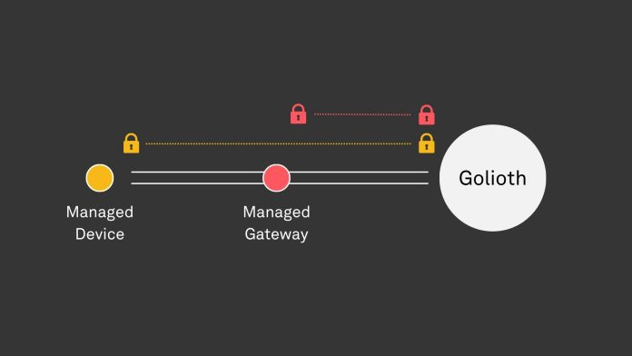  

This application shows how Golioth Connectivity allows a Bluetooth device to talk through a gateway up to the cloud. Bluetooth devices are often referenced as nodes in a fleet. Once connected to the cloud, the Golioth console provides ‘fleet services’ to explore.

The application is a Zephyr project. It demonstrates how to create a Pouch-base application and send Click Weather board data on the Bluetooth Low Energy GATT transport. **NOTE:** Without a Click Weather board, the application sends static values.  

The primary board for the project is the FRDM-MCXW71. The "Managed Device" in this demonstration targets the MCXW71. The demonstration ALSO requires a "Managed Gateway" with a connection to the cloud. Golioth provides PRE-BUILT binary images for the FRDM-RW612 board. It allows Internet access from Wi-Fi or Ethernet.


## Table of Contents
1. [Software](#step1)  
2. [Hardware](#step2)
3. [Setup Tool Environment](#step3)
4. [Setup Cloud](#step4)
5. [Setup Managed-Gateway](#step5)
6. [Setup Bluetooth-Node](#step6)
7. [Results](#step7)
8. [FAQs](#step8) 
9. [Support](#step9)
10. [Release Notes](#step10)

## 1. Software<a name="step1"></a>
The software required to evaluate this project is listed below.  
The software installation is further explained in the setup section. 
- Microsoft Visual Studio Code : [Install VS Code](https://code.visualstudio.com/) 
- MCUXpresso for VS Code 25.09.xx : Install from VS Code Extensions Marketplace  
- MCUXpresso Installer 25.09.xx : Install from VS Code Quickstart Menu or from [NXP.com](https://www.nxp.com/design/design-center/software/development-software/mcuxpresso-software-and-tools-/mcuxpresso-installer:MCUXPRESSO-INSTALLER)
- Zephyr Tool Dependencies  
  Use [MCUXpresso Installer](https://www.nxp.com/design/design-center/software/development-software/mcuxpresso-software-and-tools-/mcuxpresso-installer:MCUXPRESSO-INSTALLER) to meet ALL Zephyr dependencies
    - Zephyr SDK 2.17  
    - Git     
    - west  
    - other tools required for Zephyr  
- Golioth account : https://console.golioth.io/
- Golioth Bluetooth Pouch for FRDM-MCXW71 (Zephyr project delivered by west manifest in this repo)  
- Golioth Managed Gateway for FRDM-RW612 (Prebuilt binary link in instructions)
- openssl Tool: [Prebuilt Windows installer](https://slproweb.com/products/Win32OpenSSL.html) OR https://github.com/openssl/openssl/releases/tag/openssl-3.6.0  
- smpmgr Tool:  https://github.com/intercreate/smpmgr


## 2. Hardware<a name="step2"></a>
The project was tested with the following hardware.  
**NOTE:** If the MikroE shield is not detected the software sends static values to the cloud. 
- [NXP FRDM-MCXW71](https://www.nxp.com/part/FRDM-MCXW71)  
 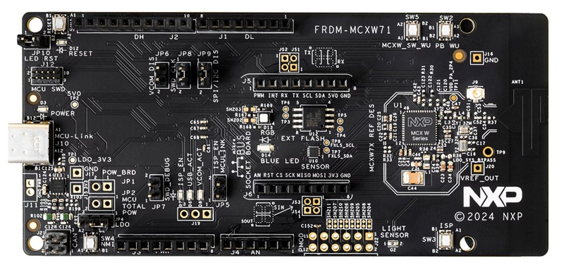

- [NXP FRDM-RW612](https://www.nxp.com/part/FRDM-RW612)  
 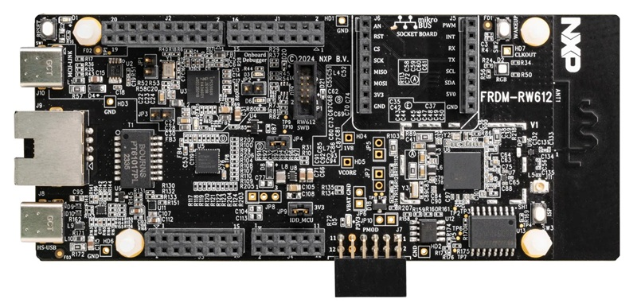  
- [MikroE Weather Click](https://www.mikroe.com/weather-click)  
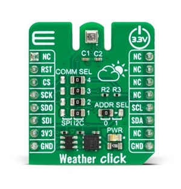  

## 3. Setup Tool Environment<a name="step3"></a>
The following instructions allow users to evaluate the Golioth Zephyr project within NXP's MCUXpresso extension for Visual Studio Code. Alternative instructions are available to assist users who prefer a command-line environment. The user will discover first-hand the benefits of the NXP extension as they work with this Golioth Zephyr project.

### 3.1 MCUXpresso and Zephyr Tool Environment 
Extra instructions are available that provide more detail and videos to assist the user in setting up their tool environment. Users can reference this training on the **NXP MCUXpresso Training Hub** : [VS Code Curriculum](https://community.nxp.com/t5/MCUXpresso-Training-Hub/MCUXpresso-for-VS-Code-Curriculum/ta-p/1924271)  

<details>
<summary style="color:darkorange">Detailed Tool Environment set-up (Click to expand)</summary>

#### 3.1.1 Install Visual Studio Code
Microsoft delivers the popular Visual Studio Code Editor for Windows, Linux, and macOS.  
Follow the instructions to properly add Visual Studio Code to your platform.  
The user experience is similar across platforms. 
The following instructions are based on a Windows installation.  

- [Install VS Code](https://code.visualstudio.com/)  

After installation, launch the tool and progress to the next step to install the NXP extension.

#### 3.1.2 Add MCUXpresso for VS Code extension
NXP extends the functionality of VS Code to assist embedded development with microcontrollers. The MCUXpresso for VS Code extension provides widgets, wizards, and shortcuts. They simplify creating, editing, and debugging projects that target NXP devices.  
The extension must be added to the default installation of VS Code.  
1. Click the **Marketplace** icon found in the main left navigation pane
1. Search "NXP" in the Marketplace search bar. Click ***MCUXpresso for VS Code***
1. Click **Install**.  The extension is added to your workspace and a new 'X' icon appears in the left navigation pane  
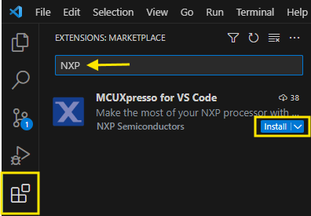

#### 3.1.3 Use MCUXpresso Installer for Tool Dependencies
There are tool requirements to develop with Zephyr. They are detailed in the [Zephyr Project](https://docs.zephyrproject.org/latest/develop/getting_started/index.html).  
However, NXP provides the MCUXpresso Installer for a consistent setup.  
The Installer monitors that the tools in the workspace meet the current Zephyr requirements.  
1. Find the **QUICKSTART PANEL** in the upper left of the MCUXpresso tool pane
1. Click ***Open MCUXpresso Installer*** from the list of most common actions
1. MCUXpresso Installer is launched or installed  
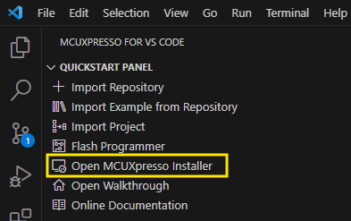  
1. Select ***Zephyr Developer***, ***LinkServer***, and ***SEGGER J-Link***
1. Click **Install**    
**NOTE:** Clicking *Show details* lists all the tools installed when the Zephyr Developer Software kit is included
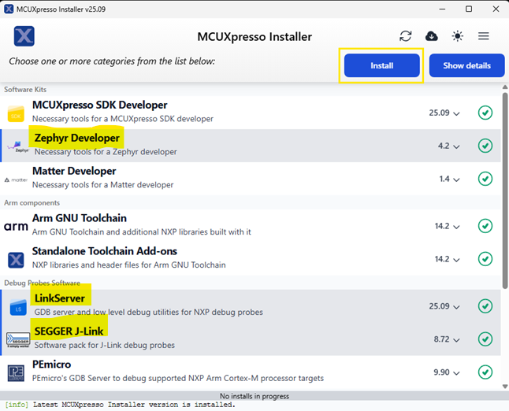  
1. Close and relaunch Visual Studio Code for the new system settings to load  

The workspace now has the proper tools to develop a Zephyr project.
</details>

## 4. Setup Cloud<a name="step4"></a>
### 4.1 Get Golioth Account for Cloud Control
This project demonstrates how to send sensor data from the MCXW71 to a Golioth cloud console.  
That requires that you have a valid Golioth account.  
This step is exceedingly easy, there is no delay in getting a valid account.  
- [Create a Golioth account](https://console.golioth.io/) at **console.golioth.io**  


Now you have taken care of the cloud side of the equation: no setting up databases or creating IAM profiles and hoping you do not give the wrong people the right access.
The Account information found in the console is used to associate the Gateway and Bluetooth devices to your Golioth project.

## 5. Setup Managed-Gateway<a name="step5"></a>
This project focuses on the Bluetooth end node, but requires a Gateway to enable the Bluetooth connection to the Cloud.  
Golioth has provided a prebuilt image for a Managed Gateway using the FRDM-RW612. The RW612 provides a Tri-radio solution: Bluetooth, 802.15.4, and Wi-Fi. Ideal for connecting to Bluetooth nodes AND providing access to the Internet using Wi-Fi or Ethernet.  

Another easy step! This one replaces the need to learn how to design an app. Instead, you can download a preexisting binary tested on the FRDM-RW612.

Follow the next instructions to program the Gateway application into the FRDM-RW612, add a Gateway device to your Golioth console, and assign credentials to the gateway.  
Bingo, you have a Bluetooth-to-Cloud gateway.
<details>
<summary style="color:darkorange">Detailed build a Managed-Gateway set-up (Click to expand)</summary>

### 5.1 Program RW612 as Bluetooth-Gateway
#### 5.1.1 Get a Prebuilt Binary
- [Download the precompiled binary](https://github.com/golioth/bluetooth-gateway?tab=readme-ov-file#release-binaries)
  - Select frdm_rw612-wifi.elf 
  - Ethernet gateway is also available, but these instructions cover the Wi-Fi use case  

#### 5.1.2 Enable Flash Programmer
The Flash Programmer in VS Code extension requires device information. This information is extracted from an active project.  
Without a project for the RW612 Gateway binary, a "Hello World" project is imported. This project is only added to enable the Flash Programmer.  
- Import "Hello World" from the imported repository.
  - Repository: Select *..bluetooth_pouch..*   
  - Board: Select RW612 FRDM 
  - Template: Select hello_world 
  - App type: Repository
  - Zephyr SDK: 0.17.0  

  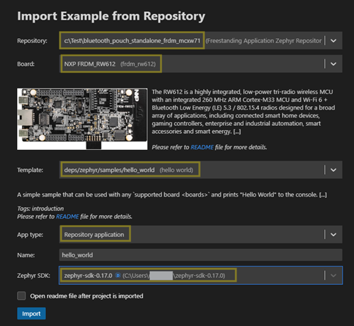  

#### 5.1.3 Fully Erase FRDM-RW612
The device must be fully erased before loading the image. We use the Flash Programmer to erase any prior contents from the FRDM-RW612 memory.  

- Launch the Flash Programmer  
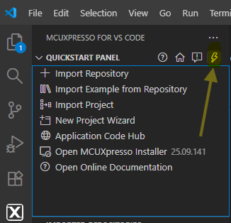  
- Select SEGGER. (NOTE: J-Link is the default debug probe on FRDM-RW612)  
- Select the **ERASE** tab
  - Select Project *Hello World* and keep all default settings
  - Keep selections for *Erase all flash banks* and *Keep wizard open* 
  - Click **Run** to erase the device 
  - Accept the SEGGER J-Link pop-up window to start the Erase  
  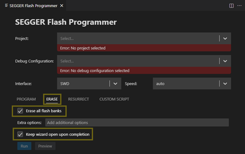  

#### 5.1.4 Program Bluetooth_Gateway into FRDM-RW612
The final step is to use the Flash Programmer to program the RW612 with the downloaded .elf image.  
- Select **PROGRAM** tab in Flash Programmer
  - Select Project *Hello World* and keep all default settings
  - Browse to the downloaded *frdm_rw612-wifi.elf* file
  - Click **Run** to program device
  - Enter RW612 in the VS Code window so SEGGER knows which device it is programming
  - Accept the SEGGER J-Link pop-up window to start programming  
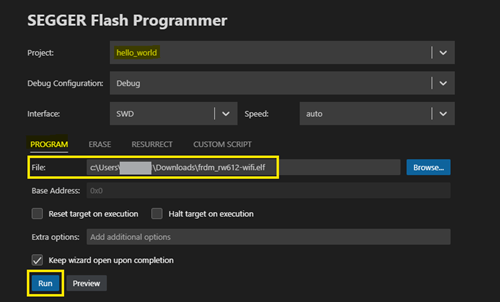  

#### 5.1.5 Verify the Application Programmed
You can verify that the Gateway Application was successfully programmed.  
- Open **SERIAL MONITOR** in the bottom tabs in VS Code.  
  - Select the COM Port showing 'JLink'
  - Click *Start Monitoring*   
- Press the button labeled **RESET** to restart the application. (On corner by USB port)  

The Credential and Wi-Fi error messages are expected, and are resolved in the following sections.  

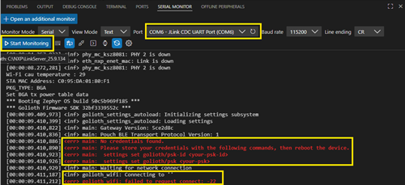  

### 5.2 Create Gateway Device on Golioth Console
- Navigate to the **Devices** view using the left list of options 
- Click **Create** to add a device  
- Name Gateway or keep default
- Click **Create**  
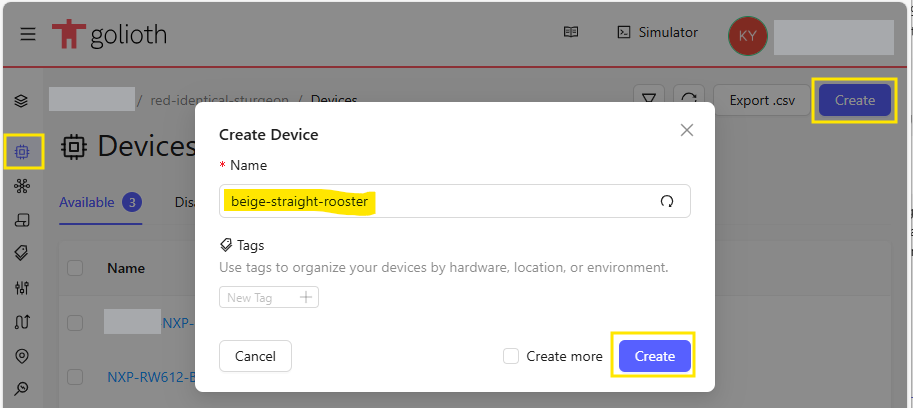  

By default, a Pre-Shared Key (PSK) credential is automatically generated. This is a PSK-ID and PSK pair that authenticates this device to the Golioth Cloud.  
- Copy the PSDK ID and PSK autogenerated by creating a device.  
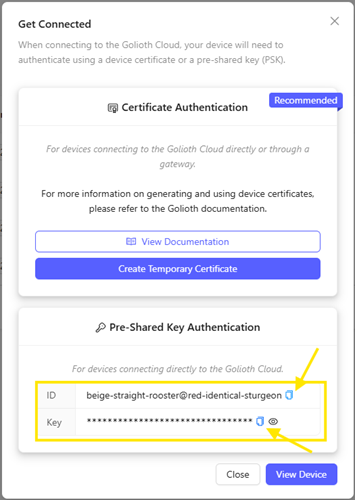

The device credentials can be accessed at a later date/time.
- Click recently added *Device*
- Select the **Credentials** tab
- The *Identity (PSK-ID)* and *Pre-Shared Key (PSK)* are listed
- Click the copy icon and record these 2 values for the following steps
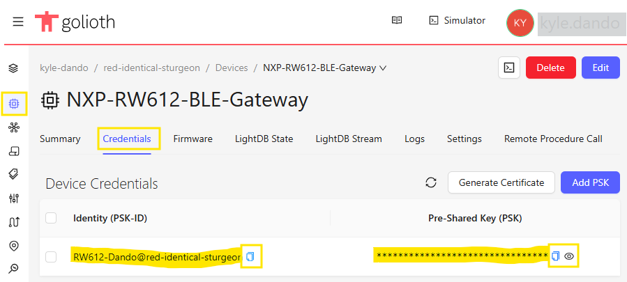  


### 5.3 Adjust Wi-Fi settings for Internet Connection
This demo was set up using an open Wi-Fi connection. If an open Wi-Fi connection cannot be guaranteed, a cellular hot-spot is a great alternative.  

- At the Serial Monitor prompt, enter the following commands to configure Wi-Fi settings 
    ``` 
    settings set wifi/ssid <your-wifi-ssid>
    settings set wifi/psk <your-wifi-password>
    ```
- The serial monitor output indicates: *Connecting to 'your-wifi-ssid'*  
The next step will set the Device credentials created in the prior step.  

### 5.4 Assign credentials to the RW612 gateway
The FRDM-RW612 is attempting to communicate with the Golioth server with the Wi-Fi connection. It still requires the authentication information to be saved.  
- Use **psk-id** copied from console  
  The psk-id is in format of Device-Name@Project-Slug
  (i.e. RW612-Dando@red-identical-sturgeon)
  ```
  settings set golioth/psk-id <psk-id>
  ```
  
- Use **psk** copied from console
The psk is the key Golioth created for the Gateway device.  
  ```
  settings set golioth/psk <psk>
  ```

</details>

## 6. Setup Bluetooth Node<a name="step6"></a>
This section contains the bulk of the activity involved in this project.
Since the Bluetooth nodes in your fleet contain the smarts (firmware) and require the credentials to talk through the gateway up to the cloud.


### 6.1 Import Bluetooth Node Project Using VS Code ACH Wizard  
<details>
<summary style="color:darkorange">How to Import Bluetooth Node Project (Click for details)</summary>

#### 6.1.1 Use the App Code Hub wizard to locate and import the Golioth Bluetooth Pouch project.  
- Click the **Application Code Hub** in the *QUICKSTART PANEL*
- Type *Golioth* in the search bar to narrow the listed applications.
- Click the *Bluetooth Pouch Standalone FRDM MCXW71* card.  
The App Code Hub wizard autopopulates the project information at the bottom of the view.
- Keep the default name of the project  
- Set the *Location* of the project. **Browse** to select a folder near the hard drive *root*. This can avoid tool issues with long paths.
- Click **Import Project**  
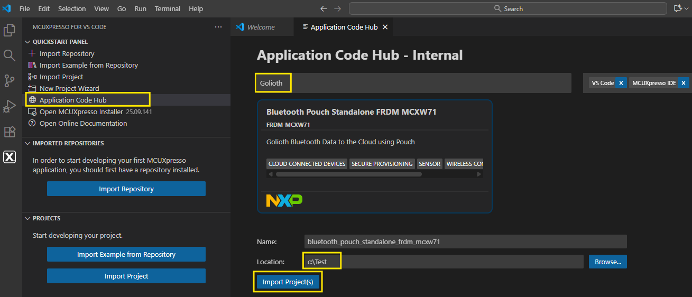  

The MCUXpresso import wizard begins the process of adding the project to your workspace.  
The first step recognizes the Zephyr format of the repo. This initiates that west commands are used to populate the repo in the location you selected.  

The image below captures the Terminal output during the import process. It shows the Zephyr west commands being executed and can help you track the progress of the import.  

**_NOTE:_** The import can take several minutes. The project is importing fresh versions of the Golioth and Zephyr software repositories. It does have a minimal west manifest, to restrict the import to only the Zephyr dependencies necessary for the project.  

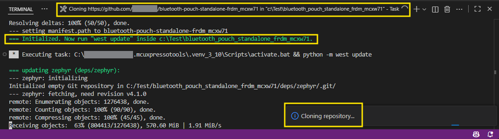

After *west* clones the project, the new folder is scanned for valid projects.  
It is possible that other ACH projects include multiple projects. 
- Select the detected *bluetooth-pouch* project
- Click **OK**   
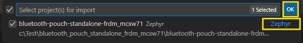

The version of the Zephyr SDK can impact the build of the project.  
- Select **zephyr-sdk-0.17.0**. Verified with these instructions.  
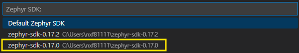

VS Code has a default *Trusted Author* pop-up.  
- Select **Yes** to complete the import  
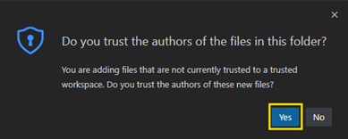  

When the import completes, the new application is found in the **PROJECTS** listed in the workspace. The project can be explored by clicking the project categories.  
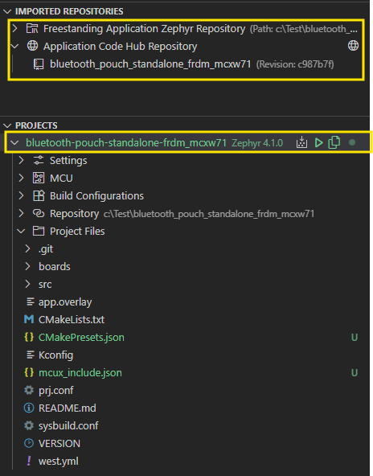

#### 6.1.2a Correct Zephyr projectType
The current version of the import wizard sets the incorrect value of *zephyr-freestanding* to **projectType**. This setting is found in the *mcuxpresso-tools.json* file.  
This needs to be changed to a zephyr-workspace to build properly.
- Click **Settings** under the *bluetooth-pouch* PROJECTS information
- Click to open mcuxpresso-tools.json
- Modify the line that sets the projectType to the following:
  ```
  "projectType": "zephyr-workspace"
  ```  
The location of the Zephyr and Golioth libraries must be corrected.  
- Modify the line that sets the SDK path to include the Golioth /deps folder.  
***NOTE: c:\\Test4\\ should be replaced with the location you chose***
  ```
    "path": "c:\\Test4\\bluetooth_pouch_standalone_frdm_mcxw71\\deps"
  ```
- Save the *mcuxpresso-tools.json* file  

#### 6.1.2b Set Board Configuration  
The Zephyr project import requires the user to select the board target.
The board target can be specified under the **PROJECTS** view.
- Click *bluetooh-pouch..* to expand the project information
- Click **Build Configurations**
- Click **debug Default**
- Click the *pencil* icon to the right of the debug configuration
- Type **MCXW71** in the Board and select the *NXP FRDM_MCXW71*
- Click **Save**  
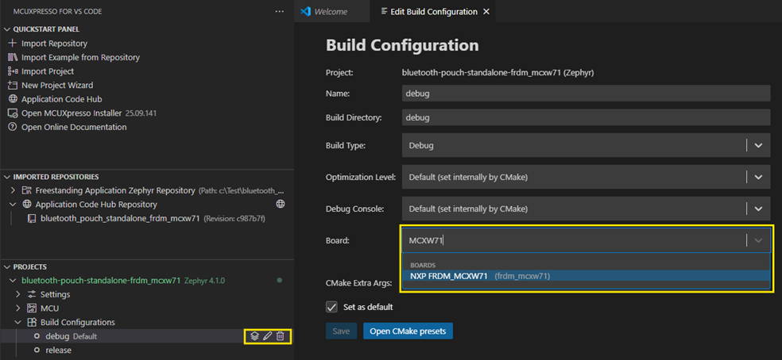  

#### 6.1.3 Full Erase of Board  
Ensure that your FRDM board does not have any old values in memory that affect a clean-start.  
- Right-click on the project
- Select **Erase Flash** from the listed options.  
**NOTE:** The full erase can also be accomplished using the Flash Programmer introduced in the Gateway setup.  

  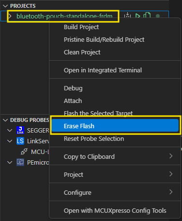  

#### 6.1.4 Clean Build Project
Initiate a pristine build of the Zephyr project. This is good practice to verify that your project is built from scratch. Iterative builds can use the Build Icon shortcut or the Build option in the drop-down menu.
- Select the Bluetooth Pouch project from the *PROJECTS* list in the workspace
- Right Click on the Project Name to display the project options Menu
- Select/Click **Pristine Build/Rebuild project**  

  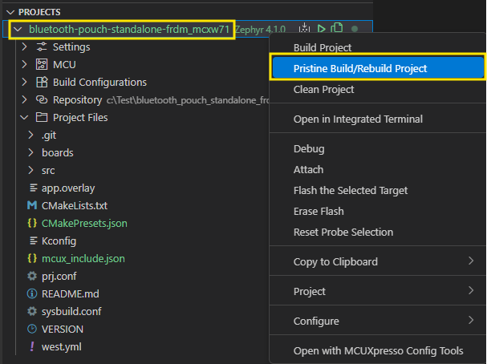  

The build process displays messages in the OUTPUT tab at the bottom of the workspace.  
The output is helpful in reviewing the steps in the Zephyr project build.  

- Load Zephyr modules, or the ingredients required for the build
- Devicetree activity. Device Tree Compiler, Board DTS (*frdm_mcxw71.dts*), and Project Specific Overlay file (*frdm_mcxw71.overlay*); Generation of Zephyr devicetree files
- Kconfig settings gathered and integrated into *prj.conf* and other config locations
- Loading of necessary software components for NXP MCXW716C device
- Use of Gnu compiler 12.2.0 based on selection of Zephyr SDK v0.17.0 for this project
- Build and Linking of C project is executed successfully
- Generation of Executable zephyr.elf

Now, the project is built and is ready to be flashed to the target device.  

#### 6.1.5 Flash Bluetooth Radio Firmware from Binary Blob
The MCXW71 has a core dedicated to the wireless radio. In this project, the associated flash must be programmed to support the Bluetooth application. Once programmed, the User core has access to control the radio with the documented API.  
The device must be put into a boot mode. Then a blhost command flashes the binary to the memory for the radio core. (NOTE: MCUXpresso Installer installed blhost)
- Locate the radio Binary blob provided with the Zephyr download
  The NBU files can be found in : <zephyr workspace>/modules/hal/nxp/zephyr/blobs/mcxw71/ folder  
  ```
  ...\zephyr\modules\hal\nxp\zephyr\blobs\mcxw71
  ```
- Right Click the project name and select **Open in Integrated Terminal**  
  This opens a new terminal with a virtual environment where MCUXpresso Installer installed blhost 
- Change the directory to the location of the binary blobs  
  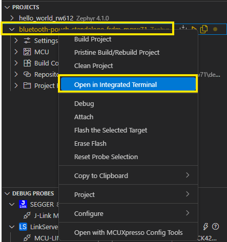  

The MCXW71 board can be put into boot mode to prepare for the image to be loaded.  
- Hold the ISP button (**SW3** near the NXP silkscreen logo)
- Remove power from the board, disconnect USB
- Power up the board while still holding down the ISP button
- After power up, release the ISP button
- Type the following *blhost* command into the Terminal  
  COMXX can be determined in the Serial Monitor. **MCU-Link VCom** in the list indicates the MCXW71 device   
  ``` 
  blhost.exe -p COMxx -- receive-sb-file mcxw71_nbu_ble.sb3
  ```
  The command results in a similar output shown below.  
  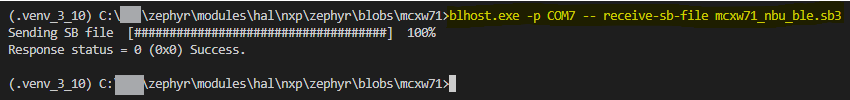  

For further information and support, visit [MCXW71 board support on the Zephyr project.](https://docs.zephyrproject.org/latest/boards/nxp/frdm_mcxw71/doc/index.html#nbu-flashing)


#### 6.1.6 Flash and Debug Project  
The MCUXpresso extension provides a few options to initiate a debug session. 
- Click the Debug icon ▶️ to the right of the project name to start a debug session 
This verifies that the build is up to date, or it is rebuilt.  
Then the device is flashed, and the workspace perspective changes to Debug.  
Alternatively, the *Project Menu* provides Debug and Flash options in the drop-down.  
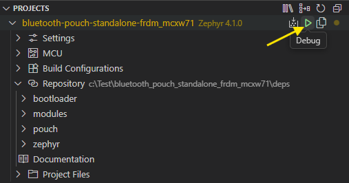  

The first debug session for a Zephyr project prompts the user to download an SVD file. This downloads device register data not available by default in the project repo.  
- Click **Download** to get the SVD data necessary for the Debug session  
 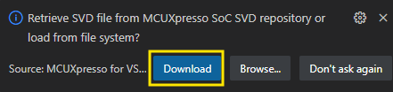  
 
 The program stops at main. You will be asked to click Resume in the next section.  

#### 6.1.7. Serial Monitor
VS Code provides an easy-to-use Serial Monitor to capture output from the device during debug.  
- Select the **SERIAL MONITOR** tab found at the bottom of the Debug view. (Along with Output and Terminal tabs)  
- Select the COM port associated with the FRDM-MCXW71.  
**NOTE:** The FRDM-MCXW71 default debug probe is listed as *MCU-Link Vcom*
- Click **Start Monitoring**  
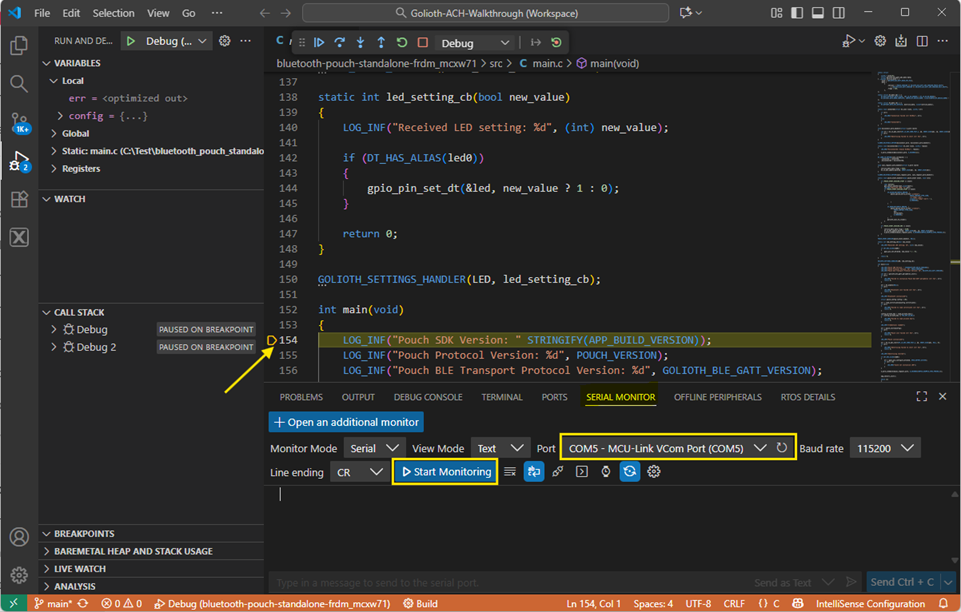  

#### 6.1.8. Run Bluetooth Pouch  
The FRDM-MCXW71 is ready to verify the Golioth application is properly installed. The application has a few important indicators that show a proper boot. However, there are still steps required to load keys and certificates for authentication onto the device. The next section covers how these are generated and loaded.  

Do the following to verify the Golioth Pouch project was properly loaded:  
- Click the **Resume** icon in the Debug toolbar   
- Verify that the correct application output is shown in the Serial Monitor  
  - littlefs partition /lfs1 is created. This is where Keys and Certs are loaded  
  - Pouch and Bluetooth start successfully
  - **NOTE:** *Failed to load certificate* is expected until the next section is completed  
  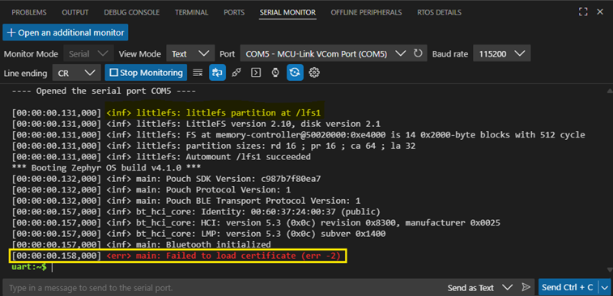  
</details>

### 6.2 Provision Bluetooth Device
One of the biggest differences Golioth users notice is that Bluetooth nodes must use certificates to connect to the cloud (through a gateway). This is explained in [our introduction video for Golioth Connectivity](https://www.youtube.com/watch?v=whcN2DsVi8w) and we will continue to publish about the role of security in our new paradigm of indirectly connected devices.  

The Pouch Bluetooth Low Energy GATT example requires a **private key and certificate** to authenticate and encrypt the communication with the Golioth Cloud.

Pouch devices use the same certificates and keys as devices that connect directly to the Golioth Cloud.  

The example credential management is implemented in *src/credentials.c*, and expects to find the following files in its file system when booting up:

- A DER encoded certificate at `/lfs1/credentials/crt.der`
- A DER encoded private key at `/lfs1/credentials/key.der`

The `/lfs1/credentials/` directory gets created automatically when the device boots for the first time. The file system was verified at the conclusion of the previous section.  

The remainder of this section shows you how to generate your own certificates and keys using openSSL. Golioth provides additional information on the PKI requirements and the process below here: [Public Key Infrastructure (PKI) docs](https://docs.golioth.io/connectivity/credentials/pki/).  

#### 6.2.1 Using openSSL to Generate Keys and Certs
[OpenSSL](https://www.ssldragon.com/blog/what-is-openssl/) is an open-source command-line tool used to generate CSRs and private keys, install SSL files, merge and convert certificates into different SSL formats, verify certificate details, and troubleshoot issues. It plays a vital role in managing and securing SSL/TLS implementations.  

This project uses the tool to produce the necessary keys and certificates to communicate securely with the cloud via Golioth.  

<details>
<summary style="color:darkorange">Generate Keys and Certificates with openSSL (Click for details)</summary>

This section requires information from your Golioth account console.  
- **PROJECT_SLUG** is a reference to the project name given to your Golioth space 
    It can be located in the upper left corner of the console. It can also be copied from the url of the Golioth console.  
    An example is highlighted in the image below. (Your project slug is different)
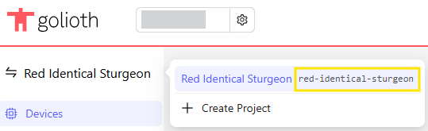

- **CERTIFICATE_ID** is a unique id that you use to associate the device. The Cert ID can be used in the names of the folder and files to identify and organize the certificates. This can be useful when device keys and certs are being generated for lots of devices. (NOTE: This example uses a generic filename in the project root folder) 

##### 6.2.1.1. Establishing a Certificate Authority 
Device certificates are issued by a certificate authority (CA). A CA is typically comprised of a root CA certificate, and one or more intermediate CA certificates, which are signed by the root and used to sign device certificates.

To generate a root CA certificate using openssl, a private key must first be generated.  
- Open a terminal in the project folder  
- Use openssl to generate a private key:  
  ```
  openssl ecparam -name prime256v1 -genkey -noout -out "ca.key.pem"
  ```

Now, use the created "ca.key.pem" to generate a certificate of authority file "ca.crt.pem".  
- Use openssl to generate the certificate:  
  ```
  openssl req -x509 -new -nodes \
    -key "ca.key.pem" \
    -sha256 -subj "/CN=Root CA" \
    -days 10 -out "ca.crt.pem"
  ```

The final step is to convert the CA cert file from the PEM to DER format.  
Keys and certificates can be encoded in different formats for distribution. The openssl commands above produce text-based PEM (.pem) encoded files. The Golioth Console currently accepts Certs in the DER format generated on Windows platforms. (CR/LF issue)  

- Use the following commands to convert the PEM formated CA certificate to DER.   

  ```
  openssl x509 -in ca.crt.pem -outform DER -out ca.crt.der
  ```  

*ca.crt.pem*, *ca.key.pem*, and *ca.crt.der* are now listed in the project files.  

**Integrating with Golioth**  
In order for Golioth to establish a chain of trust with certificates presented by devices connecting to the platform, the Root CA certificate and any intermediate CA certificates must be uploaded in the relevant Golioth project. This allows Golioth to verify that the certificate presented by a device was signed using the configured CA. If the device is then able to prove possession of the private key associated with their certificate, then you can be certain that it is a valid device and can be allowed to communicate.

- Upload the CA certificate in the Golioth project by navigating to the ***Certificates*** section under ***Credentials***.  
- Add the *ca.crt.der* file to allow console to authenticate devices associated with this Certificate Authority.  
The next section will use these CA files to generate valid device certificates.  
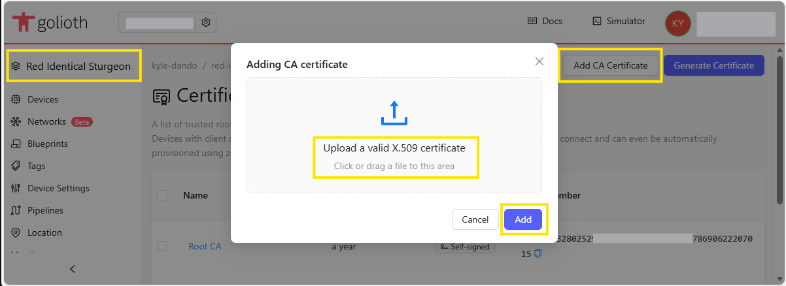

##### 6.2.1.2. Generating Bluetooth Device Certificates  
  In a production provisioning flow, a private key should never leave the secure region on the device where it is generated and stored. Instead, a certificate signing request (CSR) should be generated and exported. Some devices incorporate a dedicated secure element IC for this purpose, while others leverage integrated secure storage.  

  The CSR is signed by the device's private key and can be presented to a CA, which can then issue a signed certificate that can then be returned to the device. The signed certificate is only useful for a device that can prove possession of the associated private key. If the private key never leaves the secure region of the device, and the device has not been otherwise compromised, then only it should be able to use the certificate to authenticate and establish a secure communication channel with Golioth.  

  For demonstration purposes, the previously created local CA can be used to issue device certificates with openSSL. 
  
  - Generate a **Private Key** for the device  
  The first step created the **ca.key**, this step creates the **device.key**.  
    ```  
    openssl ecparam -name prime256v1 -genkey -noout -out "device.key.pem"
    ```  
  - Generate the **Device CSR** with the device private key
    ```
    openssl req -new \
    -key "device.key.pem" \
    -subj "/O=PROJECT_SLUG/CN=CERTIFICATE_ID" \
    -out "device.csr.pem"
    ```  
    Given the information shared above for our Project Slug the command would look like the following:
    ```
    openssl req -new \
    -key "device.key.pem" \
    -subj "/O=red-identical-sturgeon/CN=frdm-mcxw-1" \
    -out "device.csr.pem"
    ```

- Generate a **Device Certificate** by signing the certificate in the CSR with the local CA
  ```
  openssl x509 -req \
    -in "device.csr.pem" \
    -CA "ca.crt.pem" \
    -CAkey "ca.key.pem" \
    -CAcreateserial \
    -out "device.crt.pem" \
    -days 7 -sha256
  ```  

The final step is to convert the key and cert files to the format used on an embedded device.  
Keys and certificates can be encoded in different formats for distribution. The openssl commands above produce text-based PEM (.pem) encoded files. Devices frequently use the more compact binary DER (.der) encoding. DER is the format expected by the Golioth Bluetooth application.  

- Use the following commands to convert the PEM encoded keys and certificates to DER.   

  ```
  openssl ec -in device.key.pem -outform DER -out device.key.der
  ```
  ```
  openssl x509 -in device.crt.pem -outform DER -out device.crt.der
  ```  

Now, the generated key and cert files are listed in the VS Code Project Files view. The CA Key and Certificate along with the Device Key and Certificate. The .pem and .der file formats are listed.  
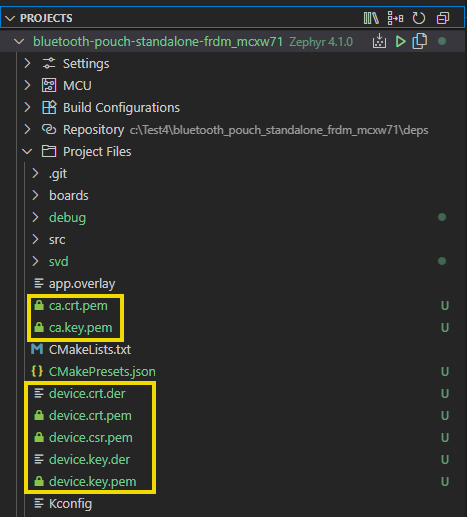
</details>

#### 6.2.2 Using SMP Manager to Load Keys and Certs
The example application that we built has a “Little file system” (littlefs or lfs) included with it. That allows us to [push the certificates onto the device using some standard SMP tooling](https://github.com/golioth/pouch/tree/main/examples/ble_gatt#authentication).  

The following instructions show how to use ***smpmgr*** to load the device key and certificate to the MCXW FRDM board.  
<details>
<summary style="color:darkorange">Load Keys and Certs with SMP Manager (Click for details)</summary>

[SMP Manager](https://github.com/intercreate/smpmgr) is a Python-based SMP client. Follow the installation instructions in the SMP Manager repository, then transfer your certificate and private key to the device using the following commands:

```
smpmgr --port $SERIAL_PORT --mtu 128 file upload $CERT_FILE /lfs1/credentials/crt.der
smpmgr --port $SERIAL_PORT --mtu 128 file upload $KEY_FILE /lfs1/credentials/key.der
```
Where `$SERIAL_PORT` is the serial port for the device, like `/dev/ttyACM0` on
Linux, or `COM1` on Windows.

`$CERT_FILE` and `$KEY_FILE` are the paths to the **DER** encoded certificate and
private key files, respectively.

For the above example, the commands look something like the following:
```
smpmgr --port COM7 --mtu 128 file upload device.crt.der /lfs1/credentials/crt.der  
smpmgr --port COM7 --mtu 128 file upload device.key.der /lfs1/credentials/key.der
```  
You see the following output in the Terminal when the files are successfully loaded to the device.  
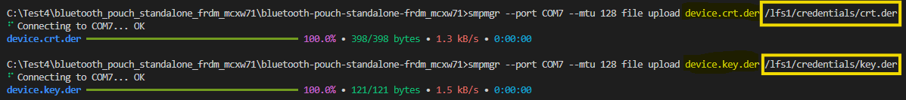  

After both files have been transferred, restart the FRDM-MCXW71 device to initialize the Pouch with the credentials.  

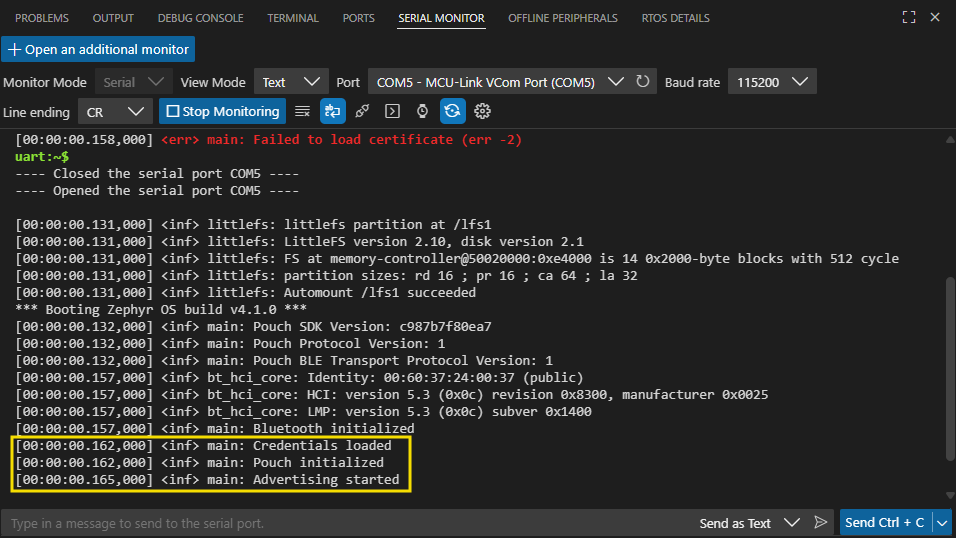  

</details>

## 7. Results<a name="step7"></a>
Once your gateway is booted up and your Bluetooth node connects through the gateway to the cloud, you see both devices listed on your Golioth console. 
If you create a node with a brand-new Certificate ID, that node is created on your project account the first time it connects (allowing zero-touch provisioning). 
### 7.1 View Connected Device on Cloud Console
It is easy to review your connected Bluetooth devices with the Golioth Cloud console. The following section covers the basic review of the console. Follow the official documentation for complete details on how to get more from the console.  

---
- **Device status**  
  The default Project tab is `Devices`. Any device that is associated with the PROJECT SLUG is listed.  

  This project lists the RW612 Gateway manually added in the *Setup Managed Gateway* section. Bluetooth Nodes are listed once they are authenticated by the Golioth server as valid members of the Project.  
  
  This is done by the meta data included in the Device Certificates.  
  - View the device details by clicking the device **Name**
  - The device view has *Identity*, *History*, and *Status*. These values are easy to associate with the connected sessions.  
  - The *Firmware* of the device is displayed. It is included in the payload. You can modify this value in the VERSION file in the project.  These values are referenced multiple places in the /deps software.

---
- **Network view (Gateway + Device)**  
  The connections of the devices in the project are depicted by a graph.  
  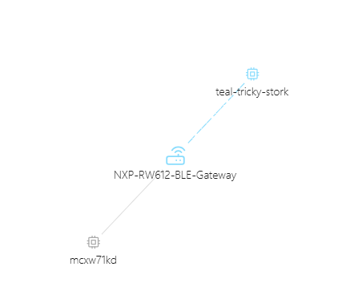  

---
- **Device Log**  
  The communication from a device is captured in the `Logs` tab. The data in this view is the device and events.  
  It is not the application data (sensor) which is displayed in the LightDB Stream tab covered in the next section.    
  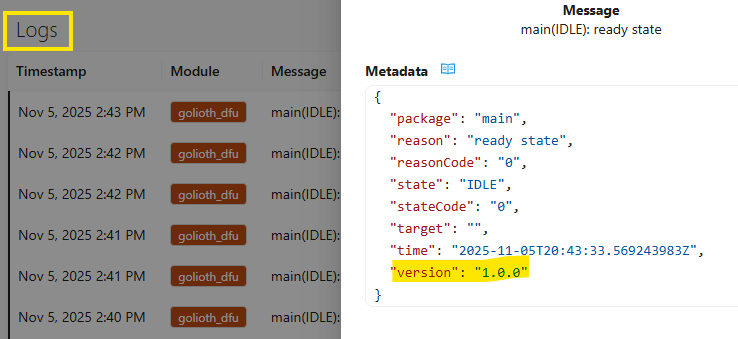  

---
- **LightDB Stream (Sensor posts)**  
  The node publishes a simulated temperature every 20 seconds (the predefined advertising interval).  
  The console has **Query Builder** to filter data based on date/time/value.  
  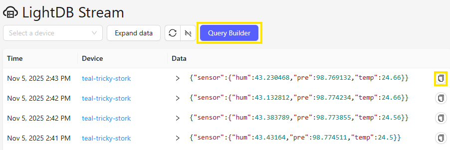  


### 7.2 Send Control to Device from Cloud Console
Golioth provides ability to send information into the remote device.  This is setup using the `Device Settings` tab. The Bluetooth Node project was instrumented with the necesary code to support change the state of the LED.  

In main.c the project defined what to do when it is asked to "handle" a *Golioth Settings* event.  
  `GOLIOTH_SETTINGS_HANDLER(LED, led_setting_cb);`  

This event handler associates an **LED** event with an existing routine *led_setting_cb* to handle the board LED.  

To interact using Golioth Settings:  
- In console, Go to `Device Settings` tab for the project  
- Click **Create** to add a new setting. Enter the expected values  
  - Key = LED
  - Type = boolean
  - Value = true 
- Approve saving this value for all devices in the Project

The device should receive a control message from the console.
The console of the Bluetooth device will display "LED = true"
- Click **Edit Project Value** and modify the LED value from true <=> false

### 7.3 Future Capabilities
- Firmware OTA
- Send Control if default project is not set up yet


## 8. FAQs<a name="step8"></a>
### 8.1 Node Authentication
> [!NOTE]
> The first time the application boots up after being erased, it has to format
> the file system, which generates the following warnings in the device log:
>
> ```log
> [00:00:00.392,486] <err> littlefs: WEST_TOPDIR/modules/fs/littlefs/lfs.c:1389: Corrupted dir pair at {0x0, 0x1}
> [00:00:00.392,517] <wrn> littlefs: can't mount (LFS -84); formatting
> ```
>
> These are expected, and can safely be ignored.
### 8.2 Internet Firewalls
> The Wi-Fi or Ethernet connection is not allowing a connection with the Golioth server.  
> The Gateway output shows a DHCP v4 was *"Received:"*.
> However, if the connection does not allow messages to be sent, the output displays *"Failed to connect: -116"*
> This network does not allow the traffic to be sent.
>
> 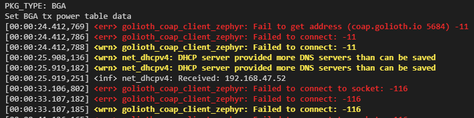  
>
> **The Suggested Solution** is to use a Hot Spot with a personal cell phone where you control access.

### 8.3 Additional Resources
> Where can i get additional information on this project
> A video walk through covers most of the steps in this project.  
>
> - [YouTube: Getting Started with Bluetooth and Golioth Connectivity](https://youtu.be/1LLZ_C0Y_hE)  
> - [Understand Keys and Certificates](https://blog.golioth.io/unwrapping-certificates/)  

### 8.4 How can I modify the sensor / GATT frequency
> This is configured using Kconfig.
> You can modify the default 20 seconds to the period that you desire.
> You will also see additional project settings available to user


## 9. Support<a name="step9"></a>
Questions regarding the content/correctness of this example can be entered as Issues within this GitHub repository or the [Golioth Bluetooth Forum](https://forum.golioth.io/c/golioth-guides/bluetooth/33).

>**Warning**: For technical questions regarding NXP Microcontrollers and the difference in expected functionality, enter your questions on the [NXP Community Forum](https://community.nxp.com/)

[](https://www.youtube.com/GoliothOfficial)
[](https://www.linkedin.com/company/golioth)
[](https://forum.golioth.io/)
[](https://twitter.com/GoliothOfficial)

## 10. Release Notes<a name="step10"></a>
| Version | Description / Update                           | Date                        |
|:-------:|------------------------------------------------|----------------------------:|
| 1.0     | Initial release on Application Code Hub        | October 16, 2025 |

## Licensing

[](https://github.com/golioth/reference-design-template/blob/main/LICENSE)


## Alternative Installation Instructions
<details>
<summary style="color:darkorange">Command Line Instructions (Click to expand)</summary>

### Command Line
```
mkdir <project-name>
cd <project-name>
python -m venv ./.venv
source .venv/bin/activate
pip install wheel west ecdsa
git clone git@github.com:/goliothlabs/frdm-mcxw71-ble.git app
west init -l ./app
west update --narrow -o=--depth=1
west zephyr-export
pip install -r deps/zephyr/scripts/requirements.txt
pip install -r deps/pouch/requirements.txt
```
</details>

<details>
<summary style="color:darkorange">Import Repository Instructions (Click to expand)</summary>

### Import Repository
The Golioth repository can be imported into the MCUXpresso for VS Code workspace using wizard for github repositories.
1. Copy GitHub url: 
    [github.com:/goliothlabs/frdm-mcxw71-ble.git](github.com:/goliothlabs/frdm-mcxw71-ble.git)
2. Click +Import Repository from QUICKSTART PANEL
3. Select Remote Tab
4. Paste the GitHub url into the field for "Repository".  Select "main" version and a name and location for the repository
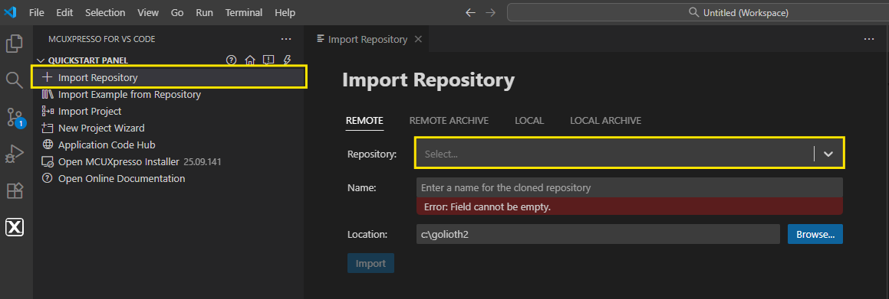
5. Repository is added to the list of available repositories
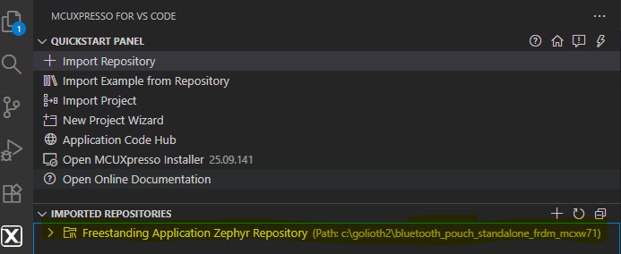
6. Click Import Example from Repository from QUICKSTART PANEL
7. Select a newly added Golioth entry from the drop-down Repository list
8. Set the following:
``` Board = FRDM-MCXW71 b
    Template = bluetooth-pouch-standalone-frdm_mcxw71
    App type = Freestanding application
    Name = Default or customize
    Location = Folder in Root of drive. Avoid long paths
    Zephyr SDK = 0.17.0.  Default is 0.17.2.  May cause build issues
```
9. Click Import to have the project added to the list of PROJECTS in workspace
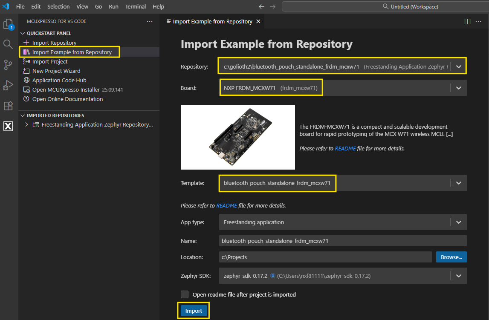
YOU CAN RETURN TO INSTRUCTIONS IN SECTION 
</details>

## Building

The example can be built with west:

```bash
west build -p -b frdm-mcxw71
```

Follow [this thread on the Golioth forum](http://forum.golioth.io/t/enabling-nxp-parts-with-golioth-s-bluetooth-support/1649) 
for any updated build instructions, as Pouch can possibly change over time.


